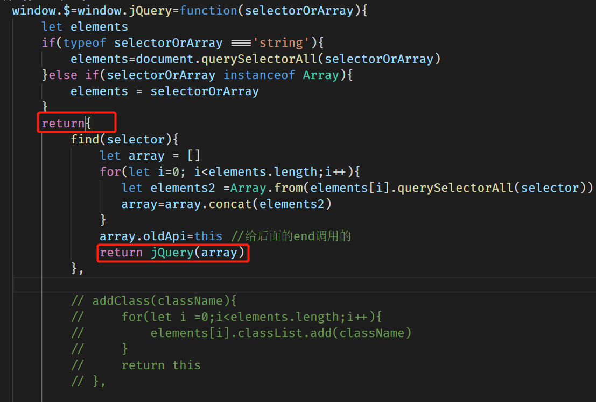

## jQuery 如何获取元素
使用jQuery的第一步，往往就是将一个选择表达式，放进构造函数jQuery()（简写为$），然后得到被选中的元素。

选择表达式可以是CSS选择器：
```
　　$(document) //选择整个文档对象

　　$('#myId') //选择ID为myId的网页元素

　　$('div.myClass') // 选择class为myClass的div元素

　　$('input[name=first]') // 选择name属性等于first的input元素
```

## jQuery 的链式操作是怎样的
通过每一步都返回自己的对象实现
```
$('.test').find('.child').addClass('red')

$('.test') //找到class='test'的所有元素

　　　.find('.child') //选择其中class='child'的

　　　.addClass('red') //添加类名red
```

window.jQuery return自己的对象
每一个被对象（方法），也return jQuery, 然后jQuery return自己的对象

## jQuery 如何创建元素
* append()
请看下面的HTML:
```html
<h2>Greetings</h2>
<div class="container">
  <div class="inner">Hello</div>
  <div class="inner">Goodbye</div>
</div>
```
你可以创建内容然后同时插入到好几个元素里面：

```JavaScript
$('.inner').append('<p>Test</p>');
```
每个新的inner <div>元素会得到新的内容：

```html
<h2>Greetings</h2>
<div class="container">
  <div class="inner">
    Hello
    <p>Test</p>
  </div>
  <div class="inner">
    Goodbye
    <p>Test</p>
  </div>
</div>
```
你也可以在页面上选择一个元素然后插在另一个元素里面：

```JavaScript
$('.container').append($('h2'));
```
如果一个被选中的元素被插入到另外一个地方，这是移动而不是复制：

```html
<div class="container">
  <div class="inner">Hello</div>
  <div class="inner">Goodbye</div>
  <h2>Greetings</h2>
</div>
```
如果有多个目标元素，内容将被复制然后按顺序插入到每个目标里面。

* appendTo().
请看下面的HTML:
```html
<h2>Greetings</h2>
<div class="container">
  <div class="inner">Hello</div>
  <div class="inner">Goodbye</div>
</div>
```
我们可以创建内容然后同时插入到好几个元素里面：
```JavaScript
$('<p>Test</p>').appendTo('.inner');
```
每个新的inner <div> 元素会得到新的内容：
```html
<h2>Greetings</h2>
<div class="container">
  <div class="inner">
    Hello
    <p>Test</p>
  </div>
  <div class="inner">
    Goodbye
    <p>Test</p>
  </div>
</div>
```
我们也可以在页面上选择一个元素然后插在另一个元素里面：
```JavaScript
$('h2').appendTo($('.container'));
```
如果这种方式选择的元素被插入到一个DOM中单一的位置的地方（注：文档中只有一个目标元素），它将被移动到目标中（不是克隆），并返回一组新的插入后的元素集合：
```html
<div class="container">
  <div class="inner">Hello</div>
  <div class="inner">Goodbye</div>
  <h2>Greetings</h2>
</div>
```
如果有多个目标元素，内容将被复制然后按顺序插入到每个目标里面。新的集合（原始元素加克隆元素）被返回。


## jQuery 如何移动元素
假定我们选中了一个div元素，需要把它移动到p元素后面。

第一种方法是使用.insertAfter()，把div元素移动p元素后面：
```
　　$('div').insertAfter($('p'));
```

第二种方法是使用.after()，把p元素加到div元素前面：
```
　　$('p').after($('div'));
```

表面上看，这两种方法的效果是一样的，唯一的不同似乎只是操作视角的不同。但是实际上，它们有一个重大差别，那就是返回的元素不一样。第一种方法返回div元素，第二种方法返回p元素。你可以根据需要，选择到底使用哪一种方法。
```JavaScript
　.insertAfter()和.after()：在现存元素的外部，从后面插入元素

　　.insertBefore()和.before()：在现存元素的外部，从前面插入元素

　　.appendTo()和.append()：在现存元素的内部，从后面插入元素

　　.prependTo()和.prepend()：在现存元素的内部，从前面插入元素
```

## jQuery 如何修改元素的属性
我们可以通过.attr()方法非常简单的改变 alt 属性并附上新值：

```JavaScript
$('#greatphoto').attr('alt', 'Beijing Brush Seller');
```
我们可以用同样的方法 添加 一个属性：
```JavaScript
$('#greatphoto')
.attr('title', 'Photo by Kelly Clark');
```
一次设置多个属性:
同时改变alt 属性 和 添加 title属性, 每个 key-value 对象将增加或者修改一个属性：
```JavaScript
$('#greatphoto').attr({
  alt: 'Beijing Brush Seller',
  title: 'photo by Kelly Clark'
});
```
当设置多个属性,包裹属性名的引号是可选的。